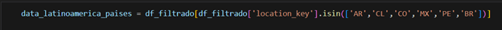
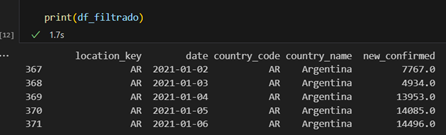
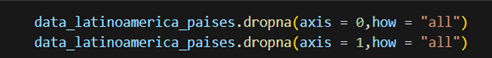

# DESARROLLO DEL PROYECTO

## 1.- AVANCE 1

a) Lee el archivo data_latinoamerica.csv con código Python en tu Visual Studio Code.  
Se importa pandas y se lee el archivo como pd.read_csv.

## b) Comprueba que el dataset cargado tiene la cantidad de registros y columnas especificadas.
El dataset original tiene un total de 12,216,057 filas y 50 columnas.
 

##c) Selecciona los países donde se expandirán: Colombia, Argentina, Chile, México, Perú y Brasil.
Se filtran los países tomando la variable “location key” como referencia ya que es la que esta normalizada.

##
d)Filtra los datos en fechas mayores a 2021-01-01.
  Se filtran los datos con df_filtrado para obtener fechas mayores a 2021-01-01.
   

##e) Compara a nivel de país para llenar valores faltantes.
Al filtrar los datos seleccionando la variable “location_key” quedan 7,692048 filas y 50 columnas.

 
  

