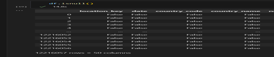

# DESARROLLO DEL PROYECTO

## 1.- AVANCE 1

a) Lee el archivo data_latinoamerica.csv con código Python en tu Visual Studio Code.  
Se importa pandas y se lee el archivo como pd.read_csv.

## b) Comprueba que el dataset cargado tiene la cantidad de registros y columnas especificadas.
El dataset original tiene un total de 12,216,057 filas y 50 columnas.
 

