# DESARROLLO DEL PROYECTO

 1.- AVANCE 1

a) Lee el archivo data_latinoamerica.csv con código Python en tu Visual Studio Code.  
Se importa pandas y se lee el archivo como pd.read_csv.

 b) Comprueba que el dataset cargado tiene la cantidad de registros y columnas especificadas.
El dataset original tiene un total de 12,216,057 filas y 50 columnas.
 

c) Selecciona los países donde se expandirán: Colombia, Argentina, Chile, México, Perú y Brasil.
Se filtran los países tomando la variable “location key” como referencia ya que es la que esta normalizada.

d)Filtra los datos en fechas mayores a 2021-01-01.
  Se filtran los datos con df_filtrado para obtener fechas mayores a 2021-01-01.
  

e) Compara a nivel de país para llenar valores faltantes.
Al filtrar los datos seleccionando la variable “location_key” quedan 7,692048 filas y 50 columnas.

   

f) Realiza una limpieza preliminar de los datos, eliminando registros nulos y corrigiendo los tipos de datos donde sea necesario, trata con valores medios, valores anteriores o valores siguientes.
Se eliminan valores nulos con el siguiente código. Quedando 3744 filas y 50 columnas.

 

g) Examina las características básicas del dataset para comprender la distribución de las variables clave como incidencia de COVID-19 e identifica las variables que consideras que son claves para tu análisis.
De acuerdo al análisis anterior y revisando la matriz de correlación se identifican las siguientes variables como las más representativas:
['location_key', 'date', 'country_code', 'country_name', 'new_confirmed',
       'new_deceased', 'cumulative_confirmed', 'cumulative_deceased',
       'cumulative_vaccine_doses_administered', 'population',
       'population_male', 'population_female', 'population_rural',
       'population_urban', 'population_density', 'human_development_index',
       'population_age_00_09', 'population_age_10_19', 'population_age_20_29',
       'population_age_30_39', 'population_age_40_49', 'population_age_50_59',
       'population_age_60_69', 'population_age_70_79',
       'population_age_80_and_older', 'gdp_usd', 'gdp_per_capita_usd',
       'latitude', 'longitude', 'area_sq_km', 
       , 'average_temperature_celsius',
       'minimum_temperature_celsius', 'maximum_temperature_celsius',
       'rainfall_mm', 'relative_humidity', 'population_largest_city',
       'area_rural_sq_km', 'area_urban_sq_km', 
       'new_recovered', 'cumulative_recovered'],

h) Guarda los datos filtrados en un archivo con el nombre DatosFinalesFiltrado.csv a fin de poder utilizarlo luego y no tener que repetir el proceso de filtrado y limpieza.
Se guardan los datos filtrados en la carpeta del proyecto.

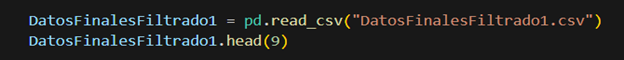 

i)Aplica bucles for y/o while para el cálculo de estadísticas descriptivas y otras métricas importantes que ofrece pandas por default.
Utilizando for generamos el siguiente bucle:

Utilizando while generamos el siguiente bucle: 

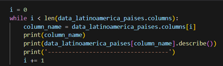 

j)¿Qué implican estas métricas y cómo pueden ayudar en el análisis de datos?
Las métricas nos ayudan a consolidar las mediciones en los diversos pasos del analisis para le gestión de la calidad de los datos.
*¿Se muestran todas las estadísticas en todas las columnas durante el análisis?
En el siguiente pantallazo podemos ver las estadísticas que no genera pandas.

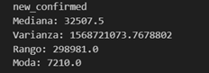

Crea una función que permita obtener la mediana, varianza y el rango. Te dejamos algunas preguntas para analizar esas medidas:

¿Qué representa la mediana?
Es el numero intermedio de un grupo de números. Mide la tendencia central, que es la ubicación del centro de un grupo de números en una distribución estadística.

k)Cómo varía la dispersión de los datos en el conjunto de datos analizado, en términos de la varianza y el rango? En el siguiente grafico de Gauss podemos ver la distribución de los datos para la variable “new_confirmed” para Brasil.

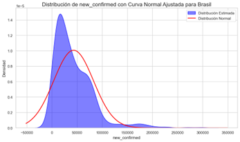 

¿Qué nos puede indicar esto sobre la consistencia o la variabilidad de los datos en relación con la 
mediana? En el siguiente grafico de Gauss podemos ver la distribución de los datos para la variable “new_deceased” para Brasil.

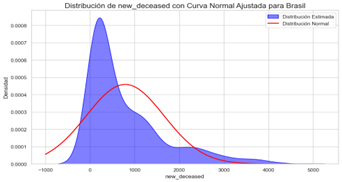 

2.- AVANCE 2 
Las visualizaciones que puedes realizar son:
a) Gráficos de barras de países contra el resto de las variables. En el siguiente grafico se muestran todas variables de forma independiente en el histograma de frecuencia.

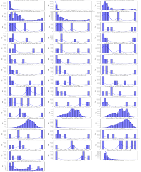

b) Matriz de correlación, trata de crear una submascara para solo tomar una parte del gráfico y filtrar por los valores mayores a 0.5.      En la siguiente grafica podemos observar la correlación de las variables numéricas > .5 y  > -.5. Este análisis nos ayudo a seleccionar las variables mas representativas.                                                                                                                        
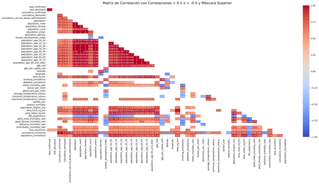 

c)Diagrama de dispersión de la temperatura media contra los casos confirmados. En el siguiente diagrama podemos ver la distribución de los datos para las variables: “average_temperature_celcius” y “new_confirmed”.

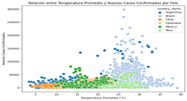

d)Diagrama de dispersión de la temperatura media contra las muertes confirmadas. En el siguiente diagrama podemos ver la distribución de los datos para las variables: “average_temperature_celcius” y “new_deceased”. 
						d.1
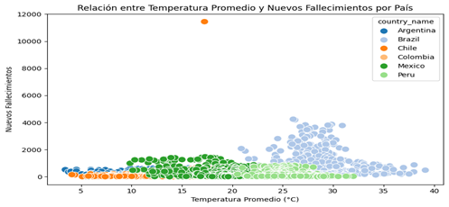 

e) Dosis administradas por país ( BoxPlot). En el siguiente diagrama podemos ver la distribución de los datos para la variable: “cumulative_vaccine_doses_administered”.

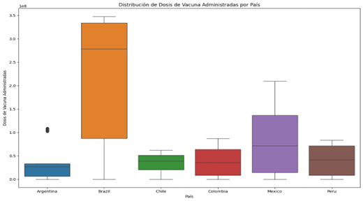 

f) Violinplot de las variables “human_development_index”,gdp_usd y cumulative_deceased para todos los países.
					f.1

g) Mapa de calor para mostar la correlación de variables.En este diagrama se observa la correlación de las variables: “population_urban”,“population_urban”,“cumulative_vaccine_doses_administered”

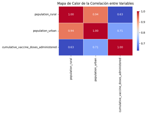

3. AVANCE 3
h) Genera gráficas acordes a tu análisis. Se muestra el grafico PairPlot para la distribución de los datos de las variables: “ human_development_index”, “gdp_usd” y “gdp_per_capita_usd”.
					h.1
   
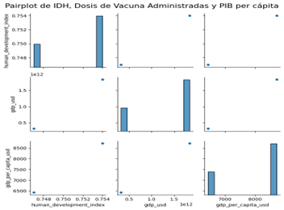 

i)Evolución Semanal de Casos Nuevos. Se muestra la tendencia de los datos utilizando la    variable: “new_confirmed” de los nuevos casos confirmados por semana. 
					i.1

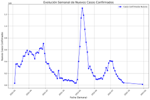 

j) Variación Mensual de Casos y Muertes. En el grafico se muestra la tendencia de los datos para las variables: “new_confirmed” y “new_deceased” en la que se observan los nuevos casos de COVID-19 y las muertes confirmadas.
					j.1
     
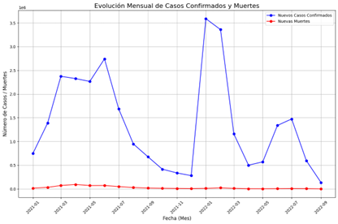 

4.-ANALISIS GENERAL DE GRAFICOS.
En los gráficos podemos analizar las relaciones entre variables y la distribución de los datos.  Por ejemplo, en el grafico b.1 (matriz de correlación de todas las variables numéricas). Podemos ver cuales son las variables que tienen un valor >.5   y tomar estas como variables representativas. En el grafico c.1 observamos la relación entre la temperatura de cada país y el numero de casos confirmados. De este análisis deducimos que el país con temperaturas mas altas que en este caso es Brasil se presentan más casos de COVID-19. En el grafico e.1 analizamos que el País con mayor numero de dosis administradas es Brasil. Esto se correlaciona con las temperaturas elevadas que predecimos que el virus del COVID-19 se propaga más fácilmente con temperaturas mas calientes. En el grafico de Violín (f1) podemos observar también como el “Indice de Desarrollo Humano” y el “Producto Interno Bruto Total (valor de todos los servicios y bienes producidos en un año) “  son casi iguales en todos los países a comparación con los casos de fallecimiento que es mayor. En la grafica superior j.1 observamos los casos por mes del año 2021 al 2022 deduciendo que los casos de fallecimiento se mantuvieron en un nivel inferior o en algunos meses no se presentaron casos de fallecimiento. 

5.-RESULTADOS PRINCIPALES Y LINEAS FUTURAS DE ANALISIS.
De acuerdo con el análisis elaborado con el soporte de los gráficos y métricas construidas. Se recomienda la ubicación de un laboratorio que puede suministrar las vacunas al área urbana principalmente porque es donde se presentan más casos acumulados confirmados, pero tomando en cuenta que también se deben distribuir en el área rural. Por otro lado, nos vamos en enfocar en Brasil que es donde se han administrado el mayor numero de dosis. Esto puede ser por tener las más altas temperaturas en diferentes áreas del País. Para el año 2021 en Brasil se suministraron la cantidad de 300303775 dosis. Un laboratorio puede producir en promedio 10,000,000 de dosis al año. Tenemos la siguiente predicción:

    
 Laboratorios con capacidad de 10 millones de dosis anuales												
														
Si cada laboratorio tiene una capacidad de producción de 10 millones de dosis al año,
 el número de laboratorios necesarios para cubrir esa demanda sería:										
														
300,303,775 dosis a 10,000,000 dosis por laboratorio≈30 laboratorios

{300,303,775 /10,000,000 / (dosis por laboratorio) = approx 30
														
En este caso, se necesitarían 30 laboratorios con una capacidad de producción de 10 millones de dosis cada uno.

											
			
Factores que afectan la capacidad de producción de vacunas:

1. Escalabilidad de la tecnología: Algunas tecnologías, como el ARN mensajero, requieren más infraestructura especializada y tiempo para escalar en comparación con las vacunas basadas en proteínas o vectores virales.
2. Suministro de materias primas: La capacidad de producción también depende de la disponibilidad de insumos clave como los lípidos para las vacunas ARNm, las proteínas recombinantes, y otros reactivos.
3. Colaboraciones y subcontratación: Los fabricantes de vacunas a menudo colaboran con otros laboratorios y fabricantes para aumentar la producción, como lo hizo Pfizer con BioNTech y AstraZeneca con varias entidades de fabricación en todo el mundo.
4. Regulaciones y capacidad de distribución: La producción también depende de las regulaciones locales e internacionales, las capacidades de distribución global, y las certificaciones sanitarias requeridas.

Dado que la producción de vacunas contra la COVID-19 ha sido centralizada principalmente en Fiocruz y Butantan, el número total de "laboratorios" para fabricar vacunas sería relativamente bajo. Sin embargo, si consideramos las plantas de producción de estas dos instituciones, podemos hacer algunas estimaciones:
Fiocruz tiene varias plantas de producción, y su capacidad máxima en 2021 fue de aproximadamente 100 millones de dosis por año. La planta de producción en Manguinhos, Río de Janeiro, fue una de las principales instalaciones para la producción de la vacuna AstraZeneca.
Instituto Butantan también tiene instalaciones de producción, principalmente en São Paulo, y produjo 100 millones de dosis de CoronaVac en 2021.
Factores para considerar:

Capacidad de producción: La capacidad de producción de cada laboratorio puede variar según la infraestructura y los recursos disponibles, así como la demanda interna y externa de vacunas.
Alianzas internacionales: Brasil ha firmado acuerdos con fabricantes internacionales, como AstraZeneca/Oxford y Sinovac, para aumentar su capacidad de fabricación local.
En general, Fiocruz y Butantan son los dos principales actores en la producción de vacunas contra la COVID-19 en Brasil. Si tienes más detalles específicos sobre los laboratorios o las plantas de producción que te interesan, podría darte más información sobre sus capacidades y funciones específicas.
  

      

  

